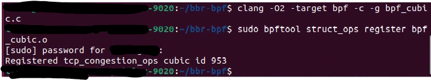
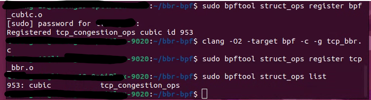

# bbr-bpf

Expected result

```sh
clang -O2 -target bpf -c -g bpf_cubic.c
sudo bpftool struct_ops register bpf_cubic.o
```



Actual result

```sh
clang -O2 -target bpf -c -g tcp_bbr.c
sudo bpftool struct_ops register tcp_bbr.o
```



Failed to register and no error message